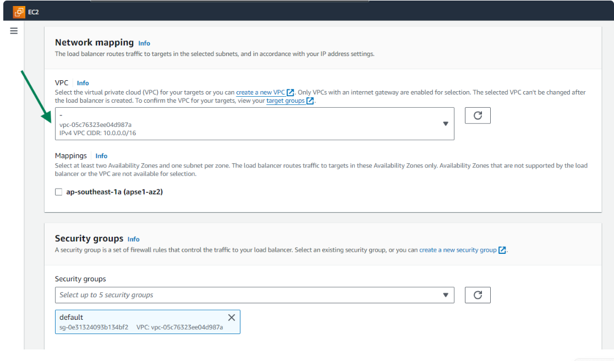
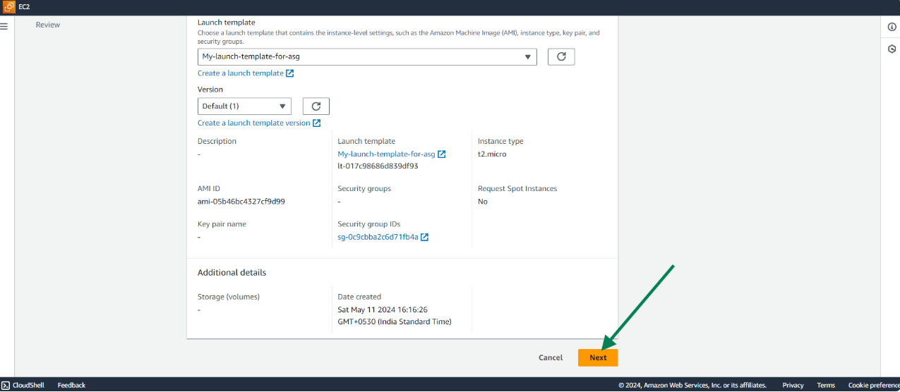
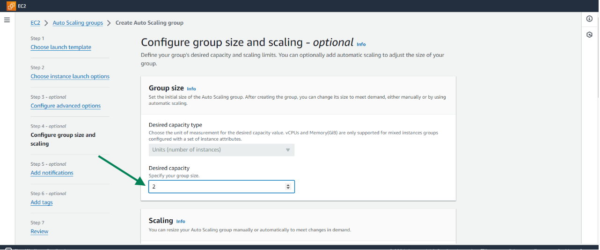

# Elastic Load Balancer and Auto Scaling Group

### Project Goals
* Understand the concept of High availability and scalability in cloud computing
* Learn about load balancers and auto scaling group in aws.
* Gain practical experience in setting up an application load balancer (ALB) and configuring auto scaling groups (ASG) in AWS
* Explore the importance of load balancing and auto scaling in maintaining reliability, availability and performance of web applications.

### What is High availability 
High availability (HA) ensures a system or component is continuously operational with minimal downtime, achieved through redundancy, failover mechanisms, and load balancing. It is crucial for maintaining consistent access to services and applications.

### What is Scalability
Scalability is the ability of a system to handle increased load by adding resources, such as hardware or instances, without affecting performance. It ensures that as demand grows, the system can expand efficiently to meet it.

### What is Load Balancer

A load balancer is a service that distributes incoming traffic across multiple servers or instances. It helps to ensure that no single server is overwhelmed, improving application performance, availability, and reliability.

#### Key Functions of Cloud Load Balancers:
* Traffic Distribution: Balances the load by distributing client requests among multiple servers.

* High Availability: Provides redundancy by rerouting traffic to healthy instances if one fails.

* Scalability: Automatically adjusts to changing traffic loads by adding or removing instances.

#### Types of Cloud Load Balancers:
* Application Load Balancer (ALB): Ideal for HTTP and HTTPS traffic. It operates at the application layer (Layer 7) and supports advanced routing.

* Network Load Balancer (NLB): Handles TCP traffic and operates at the transport layer (Layer 4). It is suitable for high-performance and low-latency applications.

* Classic Load Balancer (CLB): A legacy option that supports both Layer 4 and Layer 7 traffic but offers fewer features than ALB and NLB.

* Gateway Load Balancer

#### Examples of Cloud Load Balancers:
* AWS Elastic Load Balancer (ELB)

* Google Cloud Load Balancer

* Azure Load Balancer

Cloud load balancers are essential for maintaining the seamless operation of applications by efficiently managing and distributing traffic across multiple instances. This ensures better performance, reliability, and scalability in cloud environments.

We shall exclusively focus on the Application Load Balancer for this project.


### What is application Load Balancer
An Application Load Balancer (ALB) is a type of load balancer in cloud computing that operates at the application layer (Layer 7) of the OSI model. It is designed to handle and route HTTP and HTTPS traffic, making it ideal for web applications and microservices. Here are some key features and benefits:

#### Key Features of Application Load Balancer:
* Advanced Request Routing: ALBs can route traffic based on the content of the request, such as URL paths, host headers, HTTP methods, and query string parameters.This allows for more granular control over how requests are processed and directed to different services or applications.

* Support for Modern Web Architectures:ALBs are well-suited for microservices and container-based applications.They integrate seamlessly with AWS services like Amazon ECS, EKS, and Lambda, enabling efficient load balancing for containerized and serverless applications.

* SSL/TLS Termination:ALBs can offload the SSL/TLS encryption and decryption process, reducing the load on backend instances and improving overall performance.

* WebSockets and HTTP/2 Support:They support WebSockets and HTTP/2, enabling persistent connections and more efficient communication between clients and servers.

* Health Checks:ALBs continuously monitor the health of registered instances and only route traffic to healthy instances, ensuring high availability and reliability.

#### Benefits of Using an Application Load Balancer:
* Scalability: Automatically distributes incoming traffic across multiple targets, such as EC2 instances, containers, and IP addresses, to handle varying levels of load.

* Security: Enhances security by allowing you to centrally manage SSL/TLS certificates and enforce secure connections.

* Performance: Improves application performance through advanced routing, SSL/TLS offloading, and support for modern protocols.

* Flexibility: Provides flexible routing options, making it easier to manage complex application architectures and traffic patterns.


### What is Auto scaling group in AWS 

An Auto Scaling Group (ASG) in AWS is a collection of EC2 instances managed as a single unit for the purposes of scaling and management. It allows you to automatically adjust the number of instances in response to the demand for your application.

#### Key Features of an Auto Scaling Group:
* Automatic Scaling:Automatically increases or decreases the number of EC2 instances based on predefined policies, ensuring your application can handle varying levels of load.

* Health Checks and Replacement:Continuously monitors the health of instances. If an instance is unhealthy, it is terminated and replaced with a new one.

* Load Balancing Integration:Works seamlessly with load balancers (e.g., AWS Elastic Load Balancer) to distribute traffic among instances.

* Desired Capacity:Ensures that the number of instances always matches the desired capacity, adjusting for changes in demand.

* Scaling Policies:Uses scaling policies, which can be based on metrics like CPU usage, to determine when to add or remove instances.

#### Benefits of Using Auto Scaling Groups:
* Cost Efficiency: Only run the number of instances needed to handle the load, reducing costs.

* High Availability: Automatically replaces unhealthy instances, ensuring continuous availability of your application.

* Performance Optimization: Adjusts resources dynamically to maintain optimal performance under varying traffic conditions.

## PRACTICAL

To demonstrate,

* Create Three EC2 instances

  

 ### Create Target Group
  * Navigate to the AWS console
  * Then locate the EC2 service by using the search function and click EC2.

    

* Scroll down and locate the "Target group", Click on it and select option to "Create target group"

   

  

* Choose "Instance" as a target group.

  

* Provide a name for the Target group
* Choose port number as 80
* Select IPV4 as the ip address type
* Select the desired VPC.

  

* Keep all settings at their default value and proceed to click the Next button.

  

* Choose the instances you have created to serve as target for application load balancer and click "Include as pending below and click " Create target group"

  

  Target group has been successfuly created.

   
   


### Create Load Balancer

* Navigate to the load balancer service on the EC2 page and click on "Create Load balancer"

  

* Click the "Create" option for the application load balancer.
  
   
    
* Enter the name of the load balancer
* Select "Internet facing" as the scheme.
* Choose IPV4 as the ip address type
   
  
* Create a VPC or select VPC created in previous project-In our 
case,we have chosen a VPC we created in previous project.
NOTE-for the load balancer,you would need at least 2 public subnet 
in different AZ-

  

* Select the AZ and chose public subnet there-

  

* Use the default security group

  
    

* Select the Target group created initially 

  

* Click on create Load Balancer

  

* If you have this issue,use shorter naming.

  

* 

  NOTE: If encounter a message indicating "0 healthy target" 
and "0 unhealthy targets" it likely means you have target 
which have not been properly attached to a target group.

  

  After creating the ALB (Application Load Balancer),go to target 
  group section and check the health of your instances.

  

  NOTE: If you notice that all instances are marked as unhealthy 
 or if any individual instance is deemed unhealthy,its essential to first verify connectivity.
 You can do this by attempting to ping the intsance to test for 
 reachibility.

  To troubleshoot,follow these steps-

  1.Search for "command prompt" on your laptop.

  

  2.Copy the public ip address of the instance.

  

  3.Open command prompt and type -`ping <public_ip_address>`

   

  It appears we are unable to establish a connection to the instances
  using their public ip addresses.If you are able to connect to the 
  instances using their public ip addresses,it confirms there is connectivity
  to them.In that case,if the instances is marked unhealthy,then you may need
  to investigate further to find the root cause.

  These are some of the things one may need to keep in mind.

  **Security Group Configuration**: Make sure the security group associated with 
  your instance allow inbound traffic from the application load balance on the 
  neccessary ports.Check that the security group rules are correctly configured
  to allow traffic from the ALBs security group.

  **Network ACL Configuration**: If a network ACL(NACL) is attached to the subnet 
  where your target instances are running,review the inbound and outbound traffic 
  rules of the NACL.Ensure that the NACL is not blcoking traffic from the ALB or from the 
  internet to the instance.

  **Web Server Configuration**:Verify that your web server is configured correctly on
  your instances.Check that the web server is listening on the correct port and 
  is serving the correct content.Ensure there are no misconfigurations or errors
  in the web server configuration files.

  **Firewall rules**: Check if there is any firewall rules or ip table rules on the 
  instances that maybe blocking incoming traffic.Review the firewall settings 
  to ensure that they allow traffic from the ALB and from the internet.

  **Health check configuration**: Review the health check settings for your target group.
  Ensure that the health check path and protocol are configured correctly to match the configuration 
  of your webserver. Check that the health check endpoint is accessible and returning 
  expected response.

  **Instance Status**: Verify the status of your EC2 instance on the dashboard.Ensure that the instance 
  are running and reachable within your VPC.If there are other issues on 
  the instance,troubleshoot and resolve accordingly.

  If you see this type of output,it means the connectivity has been established.

   

  Currently,out actual output shows our instances are healthy.

  


  4.From the load balancer page,copy the DNS of the load balancer.
  5.Paste it within a new table in a chrome browser.You would notice that the ALB 
    is distributing workload evenly amongst the instances.

### Creating Auto-Scaling Group.

1.Go to search bar on the AWS console and search for Auto scaling group.

a)Click on it


2.Click on "Create auto-scaling group".


3.Click on "Create a launch template"


4.Chose a name template.

a) In the quick start section of the AWS management console,select the 
the Amazon Linux AMI 


This will provide you with a pre-configured Amazon machine Image(AMI) 
for launching instances based on the Amazon linux operating system.

b) Choose the instance type as "t2 micro"


c) Choose the "Create new key pair" option in th ekey pair section.


d) Provide a name for the key pair e)Click on create key pair.


You have successfuly created and added the key pair to the launch template.


f) In the network setting,select your public subnet you created before.
g) When selecting security groups,you have two options,use a pre-existing
security group or create one.


note:Ensure the security group allows inbound and outbound traffic for all
types of traffic for the CIDR 0.0.0.0/0

h) Click on "Advance Network Configuration"


i) Select the "Enable" option for auto-assigning public ip address.

j)And choose the security group that has an inbound and outbound rule allowing 
all traffic.


K) Now go to the advanced settings


l) In the user data section,include the following code.


```bash
#!/bin/bash  # Shebang to specify the script should be run in the Bash shell
yum update -y  # Update all packages to the latest version
yum install -y httpd  # Install the Apache HTTP server
service httpd start  # Start the Apache HTTP server service
chkconfig httpd on  # Ensure the Apache service starts on boot
echo "<html><body><h1>Welcome to My Website!</h1><p>This content is served by an EC2 instance launched by an Auto Scaling Group.</p></body></html>" > /var/www/html/index.html  # Write a simple HTML file to the web server's root directory
```
This script will prepare your server to host a basic website. 

m) Click on Create launch templete.


NOW return to the your previous tab containing auto scaling group settings.


5.Provide a name for the auto-scaling group
a) Select the launch template that was created earlier.


6.Click on "Next"



7.Choose the required instances attribute


8.Select the VPC that was created earlier.

a) Select the availability zones
b) Click on "Next"

 

9.Now choose the option to "Attach to a new load balancer".

 

a)Select the load balancer type as "Application load balancer"

b)Provide a name for the load balancer.

c)Choose "Internet facing" for the load balancer scheme.Ensure
to review the VPC ID before proceeding.


d) Select public subnets for both availability zones.


e)In the default routing configuration, you have the option to
create a new target group.


f)Provide a name for the target group.


g)Now,click on Next.


10.In this section,you can specify your desired capacity for instances
created by the Auto-scaling group.



a)Also specify the minimum and maximum capacity as per your requirement.


b)Now,proceed by clicking Next.


11.Click on Next once more to proceed further.


12.You can add tags by clicking on "Add tags"


a)Choose the desired key and value for the tag.

b)Proceed by clicking the Next button


13.Review the settings you have configured for the Auto-scaling group
and once you are satidfied,click on "Create Auto Scaling Group"


Your auto scaling group has been successfuly created.


14.Click on "new-asg"

15.Navigate to the "Instance Management" section.


Here,you will observe that the Auto Scaling group has successfuly created
instances according to the desired capacity you specified which in this case
is 2.

16.If you Navigate to the load balancer section in the EC2 page,you will notice
that our load balancer has also been created.


NOTE-If one of the instances is deleted-The Auto Scaling group will automatically
create one.